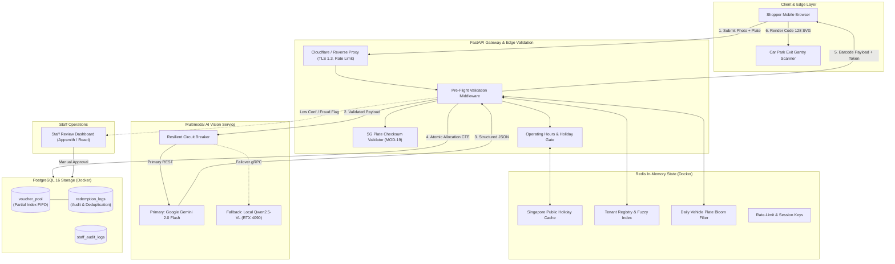
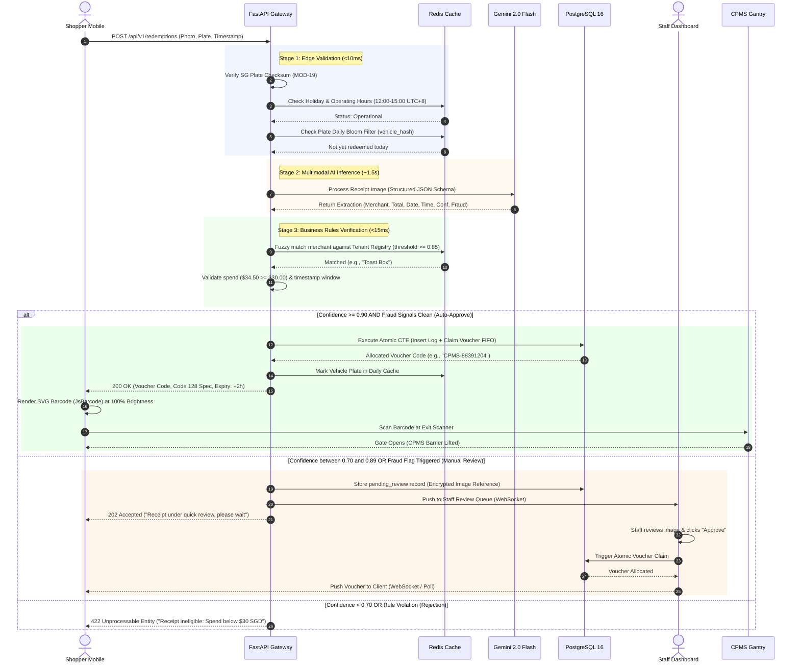

# CPMS Parking Redemption Engine: Technical Architecture & System Design

**Document ID:** ARCH-001  
**Version:** 1.0.0  
**Author:** Tech Lead Architect (`d8fdcb32-fc40-4970-81dc-a17d86334a8d`)  
**Status:** Approved for Sprint Planning  

---

## 1. Architectural Review & Gap Analysis

The initial project proposal (Section 5) specified a parallel processing pattern where the API Gateway dispatches incoming requests simultaneously to the Middleware, AI Agent Brain, and Holiday Cache:

```
[Initial Proposal Flow - Anti-Pattern]
CustomerMobile -> FastAPI -> [ Middleware (Parallel) | AI Agent Brain (Parallel) | Holiday Cache (Parallel) ]
```

### Critical Architectural Flaws Identified:
1. **Unconstrained LLM Resource Consumption:** Executing the AI Agent Brain in parallel with weekday, holiday, and operating hour checks wastes API budget and GPU cycles on submissions that are fundamentally ineligible (e.g., weekend submissions, out-of-window receipts, invalid license plates).
2. **Missing Input Checksum Pre-Filter:** Singapore vehicle license plates follow an algorithmic checksum (LTA MOD-19 algorithm). Validating this at the edge avoids processing bogus plate strings.
3. **Weak Salt/Pepper Strategy:** Simple SHA-256 on vehicle plates is susceptible to offline rainbow table precomputation (the active Singapore passenger car plate space is $< 1\text{M}$ active combinations).
4. **Voucher Pool Starvation & Lock Overhead:** Using `ORDER BY RANDOM()` causes a sequential table scan and memory sort under concurrency, degrading PostgreSQL throughput during the 12:00–15:00 lunch peak.

### Hardened Architecture Principles:
- **Strictly Sequential Fail-Fast Gateway:** Zero AI or database costs incurred if operating hours, public holidays, or plate formats fail validation.
- **HMAC-SHA256 with Secret Vault Pepper:** Vehicle plates and receipt keys are salted with an environment-injected secret pepper.
- **In-Memory Zero-Disk Image Lifecycle:** Non-flagged images are never written to disk; they exist only in memory buffers during the request lifecycle.
- **O(1) Lock-Free Voucher Allocation:** Deterministic FIFO selection backed by a partial index `WHERE status = 'AVAILABLE'` using `FOR UPDATE SKIP LOCKED`.

---

## 2. Component Topology



---

## 3. End-to-End Sequence Diagram



---

## 4. Singapore Vehicle Plate Checksum Algorithm (MOD-19)

To ensure zero invalid plate allocations, the gateway executes the Land Transport Authority (LTA) algorithm before processing:
1. Prefix conversion: Single letter has fixed numerical mapping; 2 letters use 2 digits; 3 letters discard first letter (e.g., `SBA` $\rightarrow$ `BA`).
2. Numerical extraction: Digits padded to 4 numbers with leading zeros (e.g., `123` $\rightarrow$ `0123`).
3. Weight multiplication: Weights $[9, 4, 5, 4, 3, 2]$ applied to components.
4. Modulo 19 remainder mapped to checksum letter array `['A','Z','Y','X','U','T','S','R','P','M','L','K','J','H','G','E','D','C','B']`.

Any mismatch rejects the submission in $<1\text{ms}$ with zero downstream overhead.

---

## 5. Anti-Fraud & Data Protection Architecture

### Peppered Hash Storage
Vehicle plates are never stored in plaintext:
$$\text{vehicle\_plate\_hash} = \text{HMAC-SHA256}(K_{\text{secret\_pepper}}, \text{plate\_normalized})$$
Receipt keys are strictly unique across tenant, receipt number, and transaction date:
$$\text{receipt\_hash} = \text{HMAC-SHA256}(K_{\text{secret\_pepper}}, \text{tenant\_normalized} \mathbin{\Vert} \text{receipt\_no} \mathbin{\Vert} \text{date})$$

### Ephemeral Storage Policy
- **Auto-Approved:** Receipt image buffer discarded from memory immediately after API response dispatch. Zero image bytes stored.
- **Manual Review:** Temporarily encrypted with AES-256 and uploaded to an S3/MinIO bucket with bucket lifecycle policy set to hard delete after 24 hours.
- **72h Data Pruning:** Cron job deletes all logs older than 72h, retaining only aggregated merchant redemption counts.
