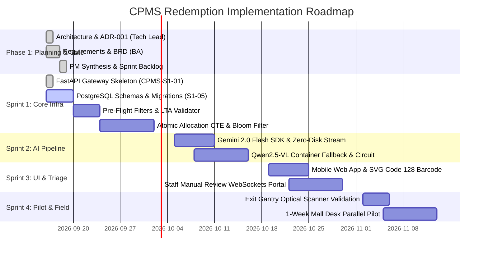

# Project Roadmap: Autonomous Receipt-to-Barcode Parking Redemption (CPMS)

**Project Identifier:** CPMS-REDEMPTION  
**Delivery Coordinator:** Project Manager & Delivery Coordinator  
**Target Delivery Window:** 6 Weeks (Sprints 1–4)  
**Status:** 🟢 Sprint 1 In Progress (Core Backend & Data Infrastructure)  

---

## 1. Executive Summary & Value Statement

The Autonomous Parking Redemption System replaces manual customer service desk operations at Singapore shopping malls with a fully automated, self-service mobile web application. By combining strict pre-flight edge validation with multimodal AI vision extraction (Google Gemini 2.0 Flash) and atomic database locking, shoppers convert paper receipts into scannable Code 128 gantry barcodes in under 30 seconds.

### Success Metrics (KPI Gate)
| Metric | Target | Measurement |
| :--- | :--- | :--- |
| **Approval Accuracy** | ≥ 95% | Manual review override rate (< 5%) |
| **Processing Latency** | < 30s | p95 duration from photo upload to barcode render |
| **System Uptime** | ≥ 99.5% | Monthly service availability |
| **Fraud Detection** | ≥ 90% | Tampered, folded, or screen-capture receipts blocked |
| **Shopper CSAT** | ≥ 4.5 / 5.0 | Post-redemption exit survey |

---

## 2. Phased Milestone Roadmap

---

## 3. Sprint Delivery Summary

| Sprint | Focus Area | Deliverables | Est. Velocity | Owner |
| :--- | :--- | :--- | :--- | :--- |
| **Sprint 1** | Core Backend & Data Infrastructure | FastAPI gateway, LTA MOD-19 validator, weekday/holiday middleware, PostgreSQL schemas, partial FIFO index, atomic allocation CTE. | 24 SP | @Backend Developer |
| **Sprint 2** | Multimodal AI Agent & Pipeline | Gemini 2.0 Flash integration, structured JSON extraction schema, local vLLM fallback, tenant fuzzy matching, fraud triage. | 30 SP | @Backend Developer, @Tech Lead Architect |
| **Sprint 3** | Mobile Frontend & Staff Dashboard | Responsive mobile web UI, client-side SVG Code 128 rendering, directional insertion guides, staff WebSocket triage dashboard. | 16 SP | @Frontend Developer, @UI/UX designer |
| **Sprint 4** | Field Testing & Production Launch | 5-device gantry optical scanning tests, 1-week parallel customer service desk pilot, automated KPI dashboards, cutover. | 11 SP | @QA Sentinel, @DevOps & Infrastructure Engineer |

---

## 4. Critical Path & Risk Matrix

| Risk Vector | Level | Trigger Condition | Mitigation Strategy |
| :--- | :---: | :--- | :--- |
| **Gantry Optical Scan Failure** | 🟡 At Risk | Mobile screen reflections or insufficient contrast prevent barcode reading. | Client forces 100% brightness prompt; directional alignment triangle; field testing across 5 smartphone screen types. |
| **AI Rate Limit & API Latency** | 🟢 On Track | Cloud provider outages or unexpected latency spikes during 12:00–15:00 surge. | Sequential pre-flight filter eliminates ~40% invalid traffic; automated circuit breaker fails over to local Qwen2.5-VL on RTX 4090. |
| **Voucher Pool Exhaustion** | 🟢 On Track | Available vouchers drop below 20% during peak lunch volume. | Daily batch replenishment cron; automated alerts via ntfy; 503 response with clean user-facing queue guidance. |
| **PDPA Data Spill** | 🟢 On Track | Raw vehicle license plates or thermal receipt PII stored on disk. | Zero plaintext persistence: plates and receipts hashed with secret pepper (`HMAC-SHA256`); in-memory image streaming; 24h auto-purge for flagged images. |
